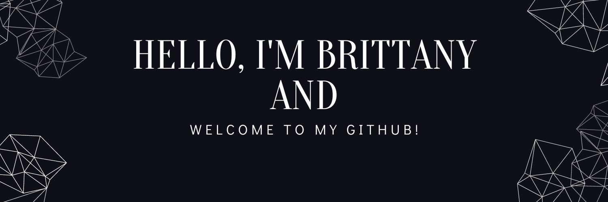

<!-- Banner -->

<!-- Socials -->

  

### :woman_technologist: About Me :

I am a Full Stack Developer from Austin, Texas. 
 
- :brain: Mentor for the ACC Software Developer Bootcamp
- :camera: Photographer
- :coffee: Caffeine lover

## Projects

## Stats 📈 

 <!-- Github Stats -->

